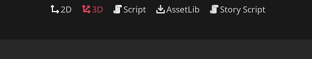

.. _doc_introduction:

Introduction to Fractural VNE
=============================

.. attention:: Please make sure you have the plugin installed in your Godot project 
	before continuing. The installation instructions are :ref:`here <doc_installation>`.

This plugin runs on a single window. By default, it will appear as a main screen window. You can access it by clicking on the **Story Script** button on the top of the editor.

If this is your first time using Godot, then you should checkout the [Godot introduction tutorials] before diving into Fractural VNE's tutorials.

	Found on the top of the Godot editor.

